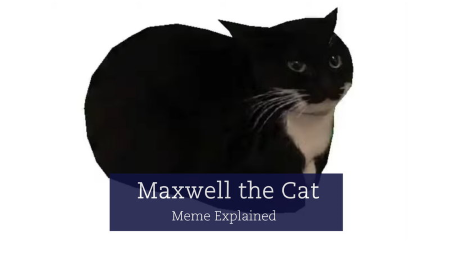

# Базові основи CSS

Для того, щоб взаємодіяти з HTML/CSS, ми взаємодіємо індентификатори (id) та класи (class).

Селектор CSS `#id` відповідає елементу на основі значення атрибута елемента id. Щоб елемент було виділено, його 
id атрибут повинен точно відповідати значенню, заданому в селекторі.

```css
/* The element with id="demo" */
#demo {
  border: red 2px solid;
}
```

Селектор `.class` вибирає елементи з певним атрибутом класу.
Щоб вибрати елементи з певним класом, напишіть крапку (.), а потім назву класу

```css
/* The element with class="demo" */
.demo {
  border: red 2px solid;
}
```

## Цей во, що ж таке CSS?

CSS - це мова стилю таблиці. Ми можемо застосовувати стилі вибору до елементів у документах HTML.

До прикладу, ми можемо змінити колір то розмір тексту

```css
p {
  color: red;
  font-size: 18px;
}
```

<p style="color: red; font-size: 18px;">Hello, World</p>

## Давайте розглянемо структуру CSS

```html
/* html code */
<h1 class="head_title">Explore</h1>
```

```css
/* The element with class="head_title" */
.head_title {
    position: absolute;
    width: 150px;
    height: 73px;
    left: 46px;
    top: 160px;

    font-family: Helvetica, 'Titillium Web';
    font-style: normal;
    font-weight: 700;
    font-size: 32px;

    color: #000000;
}
```

Отже, розглянемо перший елемент position: absolute;. 
Елементи з абсолютним розташуванням видаляються з нормального потоку, 
тому вони можуть перекривати інші елементи. Це означає, 
що ми можемо вільно переміщувати ці елементи в HTML за нашим бажанням.

Властивість `position` визначає тип методу позиціонування, що використовується для елемента.

Є п’ять різних значень позиції:

<ul style="font-size: 16px; color: blue;">
 <li>static</li>
 <li>relativ</li>
 <li>fixed</li>
 <li>absolute</li>
 <li>sticky</li>
</ul>

Властивість `width` та `height` визначає довжину (*width*) та висоту (*height*) в *px* нашого об'єкту.

До прикладу розміру нашого зображення

```html
<url scr="img.png" class="img-size">
```

```css
.img-size {
    width: 450px;
    height: 253px;`
}
```



Розміщення об'єкту [`left`, `right`, `top`]

`left` - переміщення вліво
`right` - переміщення вправо
`top` - переміщення вгору від самого верху до N-ного рівня нижче

Стиль тексту

`font-family` - стиль тексту

Властивість `font-style` використовується для встановлення стилю шрифту тексту. Ця властивість дозволяє змінювати нахил (курсивний або звичайний) тексту в межах встановленого шрифту.

Значення для властивості font-style можуть бути:

- `normal`: звичайний нахил шрифту;
- `italic`: курсивний нахил шрифту;
- `oblique`: нахил шрифту;

Властивість `font-weight` довжина тексту, а також `font-size` його розмір.

`text-shadow` - створення тінь в тексті 

Приклад: `text-shadow: 1px 1px 2px orange;` 

- Offset-x (1px) - зсув по горизонталі;
- Offset-y (1px) - зсув по вертикалі;
- Blur-radius (2px) - радіус розмиття;
- Color (black) - колір тіні.

<p style="font-size: 16px; text-shadow: 1px 1px 2px orange;">Їбати! Мої яйца сверблять</p>

### Джерело інформації до всіх властивостей CSS

[Довідник по CSS властивостям](https://css.in.ua/css/properties)

