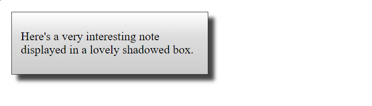
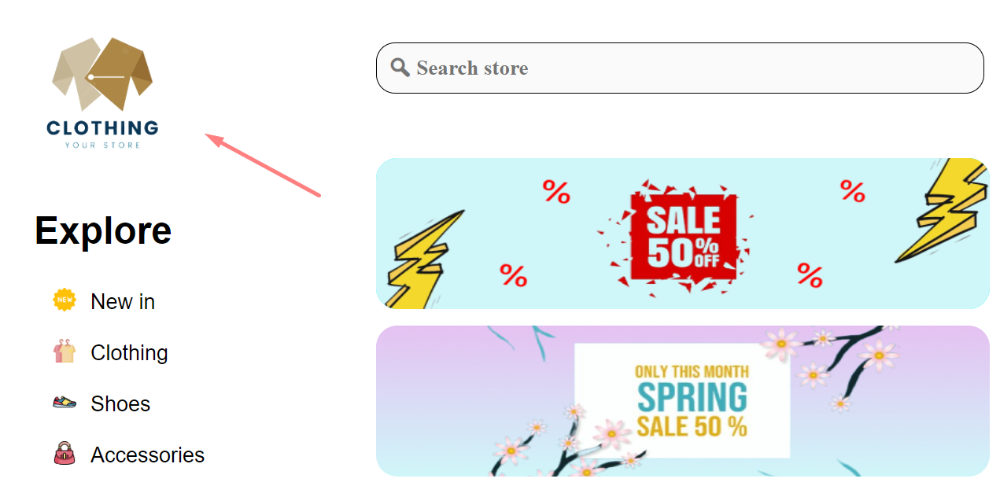

## Основні поняття мови HTML та базова структура

HTML (Hypertext Markup Language) — це мова гіпертекстової розмітки опису структури сторінок документів, яка дозволяє звичайний текст форматувати в абзаци, заголовки, списки та інші структури

#### Отже, розглянемо базову структуру HTML:

```html
<!DOCTYPE html>
<html lang="en">
  <head>
    <meta charset="UTF-8">
    <title>My first page</title>
  </head>
  <body></body>
</html>
```

### DOCTYPE

Перша структура в HTML-Документі, він же елемент <!DOCTYPE>, що не відображається 
на сторінці. Його завдання — вказати браузеру, який стандарт HTML використовується в цьому документі.

```html
<!DOCTYPE html>
```

### Позначення HTML-документа

Розглянемо тег `<HTML>`, що включає в себе всі інші теги HTML і весь інформаційний зміст документа.

```html
<HTML>…</HTML>
```

### Заголовок документа

Тег `<head>` служить для зберігання службової інформації.

```html
<head>…</head>
```

### Назва документа

Тег `<title>` назва документа, яка відображається в рядку заголовка Internet Explorer.

```html
<title>… </title>
```

### Тіло документа

Тег `<body>` тіло документа містить весь текст з інформацією і всі теги HTML, 
які використовуються для форматування тексту.

```html
<body>…</body>
```

### Метатег документа

Метатег `<meta>` визначає метадані про документ HTML. 
Теги `<meta>` завжди входять до елемента `<head>` і зазвичай 
використовуються для визначення набору символів, опису сторінки, 
ключових слів, автора документа та параметрів вікна перегляду.

```html
<head>
  <meta charset="UTF-8">
  <meta name="description" content="Free Web tutorials">
  <meta name="keywords" content="HTML, CSS, JavaScript">
  <meta name="author" content="John Doe">
  <meta name="viewport" content="width=device-width, initial-scale=1.0">
</head>
```

### Тег `<div></div>`: елемент розділу вмісту

Елемент HTML є загальним контейнером для вмісту потоку. 
За домогою `<div>`, використувуємо для стилізацію сайту за допомогою CSS

Будучи «*чистим*» контейнером, `<div>` 
елемент за своєю суттю нічого не представляє. 
Натомість він використовується для групування вмісту, 
щоб його можна було легко стилізувати за допомогою атрибутів `class` або `id`

#### HTML example:

```html
<div class="shadowbox">
    <p>Here's a very interesting note displayed in a lovely shadowed box.</p>
</div>
```

#### CSS example:

```css
.shadowbox {
  width: 15em;
  border: 1px solid #333;
  box-shadow: 8px 8px 5px #444;
  padding: 8px 12px;
  background-image: linear-gradient(180deg, #fff, #ddd 40%, #ccc);
}
```

### Result:



### Іконка для веб-сайту

```html
<link rel="icon" type="image/png" href="image/favicon.ico"/>
```

### Підключуння CSS файлу

```html
<link rel="stylesheet" href="css/styles.css">
```

### Встановлення зображення

```html

```

**CSS файл**

```css
.logo-img {
    position: absolute;
    width: 136px;
    height: 136px;
    left: 38px;
    top: 16px;
}
```

**Result**



### Створення списка

Тег `<ul>` визначає невпорядкований (маркірований) список.

Використовуйте `<ul>` тег разом із тегом `<li>` для створення невпорядкованих списків.

```html
<ul>
    <li>Coffee</li>
    <li>Tea</li>
    <li>Milk</li>
</ul>
```

**Result of list**

<ul>
    <li>Coffee</li>
    <li>Tea</li>
    <li>Milk</li>
</ul>

### Iнші теги

Тег `<table>` призначений для створення таблиці

```html
<table>
  <tr>
    <th>Company</th>
    <th>Contact</th>
    <th>Country</th>
  </tr>
  <tr>
    <td>Alfreds Futterkiste</td>
    <td>Maria Anders</td>
    <td>Germany</td>
  </tr>
  <tr>
    <td>Centro comercial Moctezuma</td>
    <td>Francisco Chang</td>
    <td>Mexico</td>
  </tr>
</table>
```

#### Result of table

<table>
  <tr>
    <th>Company</th>
    <th>Contact</th>
    <th>Country</th>
  </tr>
  <tr>
    <td>Alfreds Futterkiste</td>
    <td>Maria Anders</td>
    <td>Germany</td>
  </tr>
  <tr>
    <td>Centro comercial Moctezuma</td>
    <td>Francisco Chang</td>
    <td>Mexico</td>
  </tr>
</table>

### Інформаційна таблиця тегів

<table>
  <tr>
    <th>Теги</th>
    <th>Інформація</th>
  </tr>

  <tr>
    <td>< h1, h2, h3 ... ></td>
    <td>Заголовок першого, другого і третього рівня</td>
  </tr>

  <tr>
    <td>< !--...-- ></td>
    <td>Визначає коментар в документі</td>
  </tr>

  <tr>
    <td>< a href="#" ></td>
    <td>Створює посилання</td>
  </tr>

  <tr>
    <td>< b ></td>
    <td>Робить текст жирним</td>
  </tr>

  <tr>
    <td>< blockquote ></td>
    <td>Довга цитата</td>
  </tr>

  <tr>
    <td>< buttom ></td>
    <td>Визначає кнопку</td>
  </tr>

  <tr>
    <td>< form ></td>
    <td>Визначає форму</td>
  </tr>

  <tr>
    <td>< input ></td>
    <td>Поле вводу даних</td>
  </tr>
</table>

### Всі інші тегі можна дізнатися за посиланням

[Клік](https://css.in.ua/html/tags)
